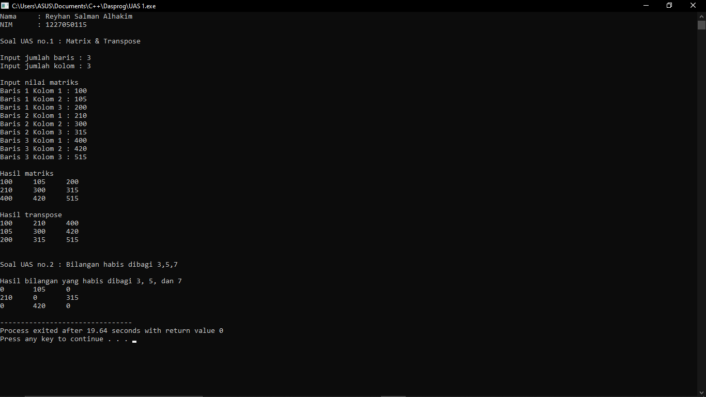

# Ujian Akhir Semester 
  Mata Kuliah : Dasar Pemrograman
  Nama : Reyhan Salman Alhakim
  NIM : 1227050115
  Jurusan : [Teknik Informatika](http://if.uinsgd.ac.id/) [UIN Sunan Gunung Djati Bandung](https://uinsgd.ac.id/) 

## Deskripsi Umum
  

## Source Code
	  #include <iostream>
	  using namespace std;

	  int main () {
	    //data diri
	    cout << "Nama \t : Reyhan Salman Alhakim" << endl;
	    cout << "NIM \t : 1227050115" << endl << endl;

	    //variabel
	    int matrix[100][100], transpose[100][100], row, colomn, x, y, hasil;

	    //input jumlah baris & kolom
	    cout << "Soal UAS no.1 : Matrix & Transpose " << endl << endl;
	    cout << "Input jumlah baris : ";
	    cin >> row;
	    cout << "Input jumlah kolom : ";
	    cin >> colomn;

	    //input nilai
	    cout << endl << "Input nilai matriks" << endl;
	    for (x = 0; x < row; x++) {
	      for (y = 0; y < colomn; y++) {
		cout << "Baris " << x + 1 << " Kolom " << y + 1 << " : ";
		cin >> matrix[x][y];
	      }
	    }

	    //hasil matrix & transpose
	    cout << endl << "Hasil matriks" << endl;
	    for (x = 0; x < row; x++) {
	      for (y = 0; y < colomn; y++) {
		cout << matrix [x][y] << "\t";
	      }
	    cout << endl;
	    }
	    for (x = 0; x < row; x++) {
	      for (y = 0; y < colomn; y++) {
		transpose[y][x] = matrix [x][y];
	      }
	    }
	    cout << endl << "Hasil transpose" << endl;
	    for (x = 0; x < colomn; x++) {
	      for (y = 0; y < row; y++) {
		transpose[y][x] = matrix [x][y];
		cout << transpose[x][y] << "\t";
	      }
	    cout << endl;
	    }

	    //hasil bilangan habis dibagi 3,5,7
	    cout << endl << endl << "Soal UAS no.2 : Bilangan habis dibagi 3,5,7 " << endl << endl;
	    cout << "Hasil bilangan yang habis dibagi 3, 5, dan 7" << endl;
	    for (x = 0; x < row; x++) {
	      for (y = 0; y < colomn; y++) {
		if (matrix[x][y] % 3 == 0 && matrix[x][y] % 5 == 0 && matrix[x][y] % 7 == 0) {
		  hasil = matrix [x][y];
		}
		else {
		  hasil = 0;
		}
		cout << hasil << "\t";
	      }
	      cout << endl;
	    }

	  return 0;
	  }

## Output

